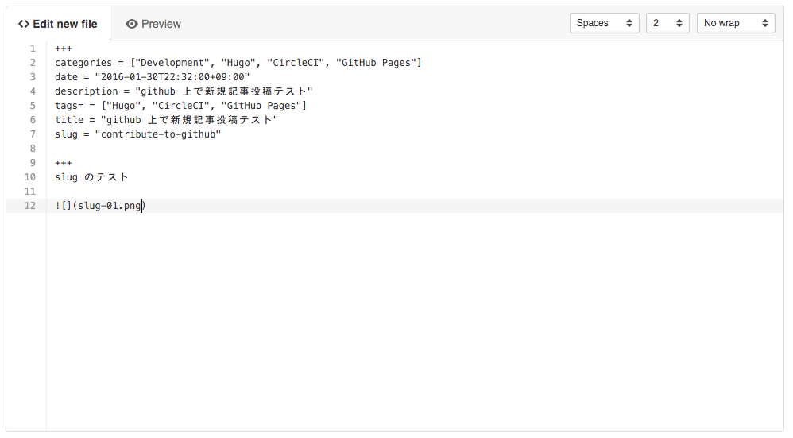

+++
categories = ["Development", "Hugo", "CircleCI", "GitHub Pages"]
date = "2016-01-30T22:32:00+09:00"
description = "github 上で新規記事投稿テスト"
tags= = ["Hugo", "CircleCI", "GitHub Pages"]
title = "github 上で新規記事投稿テスト"
slug = "contribute-to-github"

+++
slug のテスト

